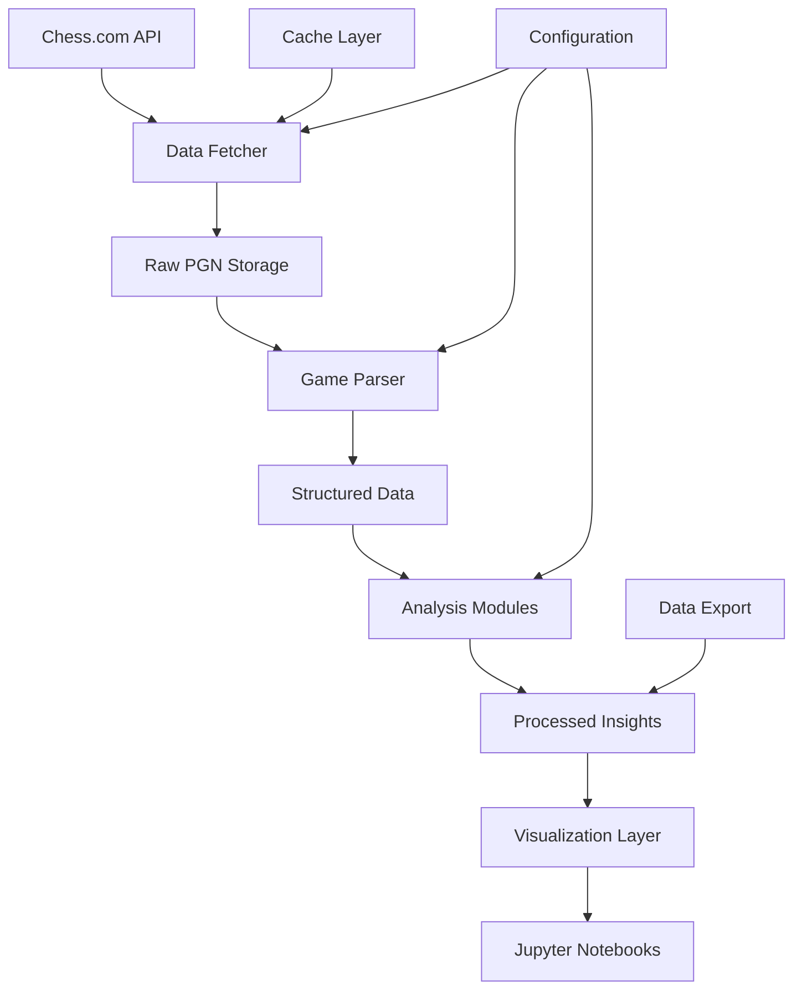

# Chess Analysis Application Architecture

## Overview
A comprehensive Python-based chess game analysis tool that downloads games from Chess.com and provides detailed insights into playing patterns, strengths, and areas for improvement.

## Technology Stack
- **Core Language**: Python 3.8+
- **Chess Engine**: python-chess library
- **Data Analysis**: pandas, numpy
- **Visualization**: matplotlib, seaborn, plotly
- **Interactive Interface**: Jupyter notebooks
- **API Integration**: requests library for Chess.com API
- **Data Storage**: JSON/CSV files

## Project Structure
```
chessAnalysit/
├── src/
│   ├── __init__.py
│   ├── data_fetcher.py          # Chess.com API integration
│   ├── game_parser.py           # PGN parsing and data extraction
│   ├── analyzers/
│   │   ├── __init__.py
│   │   ├── opening_analyzer.py  # Opening performance analysis
│   │   ├── tactical_analyzer.py # Blunder and tactical analysis
│   │   ├── endgame_analyzer.py  # Endgame performance analysis
│   │   ├── time_analyzer.py     # Time management analysis
│   │   └── rating_analyzer.py   # Rating progression analysis
│   ├── visualizers/
│   │   ├── __init__.py
│   │   ├── opening_viz.py       # Opening visualizations
│   │   ├── tactical_viz.py      # Tactical pattern visualizations
│   │   ├── performance_viz.py   # Performance trend visualizations
│   │   └── dashboard.py         # Main dashboard components
│   └── utils/
│       ├── __init__.py
│       ├── chess_utils.py       # Chess-specific utilities
│       └── data_utils.py        # Data processing utilities
├── data/
│   ├── raw/                     # Raw PGN files
│   ├── processed/               # Processed game data
│   └── cache/                   # API response cache
├── notebooks/
│   ├── main_analysis.ipynb      # Main interactive analysis notebook
│   ├── opening_deep_dive.ipynb  # Detailed opening analysis
│   ├── tactical_review.ipynb    # Tactical pattern analysis
│   └── performance_trends.ipynb # Performance tracking
├── config/
│   └── settings.py              # Configuration settings
├── tests/
│   └── test_*.py               # Unit tests
├── requirements.txt
├── setup.py
└── README.md
```

## Core Components

### 1. Data Fetcher (`data_fetcher.py`)
- **Purpose**: Download games from Chess.com API
- **Key Features**:
  - Authenticate with Chess.com API
  - Fetch games by date range or archive
  - Handle rate limiting and pagination
  - Cache responses to avoid redundant API calls
  - Support for different game formats (rapid, blitz, bullet)

### 2. Game Parser (`game_parser.py`)
- **Purpose**: Extract structured data from PGN files
- **Key Features**:
  - Parse PGN headers (date, time control, ratings, result)
  - Extract move sequences and timestamps
  - Calculate position evaluations using Stockfish
  - Identify game phases (opening, middlegame, endgame)
  - Extract tactical motifs and patterns

### 3. Analysis Modules

#### Opening Analyzer (`opening_analyzer.py`)
- **Metrics**:
  - Win/loss rates by opening
  - Most played openings
  - Opening preparation depth
  - Theoretical vs practical performance
  - Color-specific opening preferences

#### Tactical Analyzer (`tactical_analyzer.py`)
- **Metrics**:
  - Blunder frequency and severity
  - Missed tactical opportunities
  - Tactical motif recognition (pins, forks, skewers)
  - Critical position handling
  - Calculation accuracy under time pressure

#### Endgame Analyzer (`endgame_analyzer.py`)
- **Metrics**:
  - Conversion rates in winning positions
  - Defensive accuracy in losing positions
  - Endgame knowledge gaps
  - Pawn structure evaluation
  - King activity patterns

#### Time Analyzer (`time_analyzer.py`)
- **Metrics**:
  - Time usage patterns by game phase
  - Time pressure performance
  - Move quality vs time spent
  - Clock management efficiency
  - Critical moment time allocation

#### Rating Analyzer (`rating_analyzer.py`)
- **Metrics**:
  - Rating progression over time
  - Performance vs rating expectations
  - Streak analysis (winning/losing)
  - Opponent strength correlation
  - Format-specific performance

### 4. Visualization Components
- Interactive charts using matplotlib and plotly
- Performance dashboards
- Trend analysis graphs
- Heatmaps for position-based insights
- Statistical distribution plots

## Data Flow Architecture



## Key Analysis Features

### 1. Opening Performance Analysis
- Success rates by opening variation
- Preparation depth vs performance correlation
- Color preference analysis
- Opening repertoire gaps identification

### 2. Tactical Pattern Recognition
- Blunder categorization and frequency
- Missed opportunity identification
- Pattern recognition improvement tracking
- Time pressure impact on tactics

### 3. Endgame Mastery Assessment
- Theoretical endgame knowledge testing
- Practical conversion rates
- Common endgame mistake patterns
- Improvement recommendations

### 4. Performance Trends
- Rating progression analysis
- Seasonal performance variations
- Format-specific strengths/weaknesses
- Opponent strength adaptation

### 5. Time Management Insights
- Optimal time allocation strategies
- Time pressure performance correlation
- Critical moment identification
- Clock management recommendations

## Configuration and Customization
- User-specific settings (username, API keys)
- Analysis parameters (depth, time ranges)
- Visualization preferences
- Export formats and destinations

## Future Enhancements
- Integration with other chess platforms (Lichess, FICS)
- Machine learning models for pattern prediction
- Personalized training recommendations
- Comparative analysis with similar-rated players
- Mobile-friendly dashboard